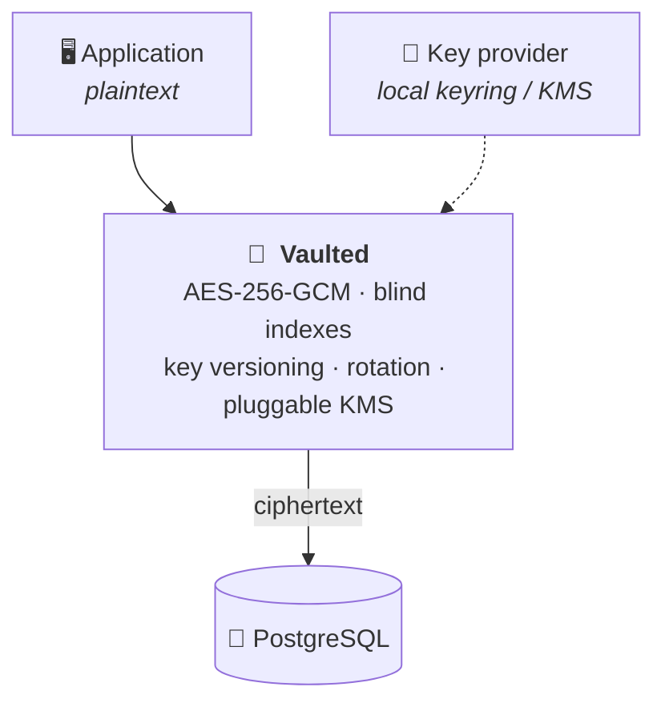

<div align="center">

# 🔐 Vaulted

**Field-level encryption for databases, in Rust.**

Your application keeps working with plaintext.<br>
Your database only ever holds ciphertext — and the keys never go near it.

[](https://github.com/alpkeskin/vaulted/actions/workflows/ci.yml)
[](https://crates.io/crates/vaulted-core)
[](https://docs.rs/vaulted-core)
[](#compatibility)
[](LICENSE)

[Quick start](#-quick-start) ·
[Features](#-what-it-does) ·
[PostgreSQL](#-postgresql) ·
[CLI](#-cli) ·
[Docs](#-documentation) ·
[Contributing](CONTRIBUTING.md)

</div>

---



> [!IMPORTANT]
> **Status: v0.1, pre-1.0.** The core is complete — the ciphertext format is
> specified, versioned and fuzzed, key rotation works end to end, and the
> hostile-input surfaces are covered by property and fuzz tests. **The API may
> still change before 1.0.** Security policy and design commitments live in
> [SECURITY.md](SECURITY.md).

## 🚀 Quick start

```toml
[dependencies]
vaulted-core = "0.1"
```

```rust
use vaulted_core::{BlindIndexConfig, FieldConfig, LocalKeyProvider, Normalization, Vault};

let vault = Vault::builder()
    .key_provider(LocalKeyProvider::generate()?)      // a KMS in production
    .field(
        FieldConfig::new("users.email")?
            .with_normalization(Normalization::Email)
            .with_blind_index(BlindIndexConfig::new()),
    )
    .build()?;

// INSERT INTO users (email_ciphertext, email_blind_index) VALUES ($1, $2)
let row = vault.protect("users.email", "Alp@Example.com")?;
let ciphertext = row.ciphertext.to_string();
let blind_index = row.blind_index.unwrap().to_hex();

// SELECT * FROM users WHERE email_blind_index = $1
let lookup = vault.blind_index("users.email", "  alp@example.COM ")?.to_hex();
assert_eq!(lookup, blind_index);

// What comes back is exactly what went in.
assert_eq!(&*vault.decrypt_str("users.email", &ciphertext)?, "Alp@Example.com");
```

<table>
<tr><th align="left">Column</th><th align="left">What actually lands in the database</th></tr>
<tr><td><code>email_ciphertext</code></td><td><code>vlt:v1:key-0001:aes256gcm:G_--PFtn4OT052Cj8Q9TS3_F4oU5DjL5kePSv…</code></td></tr>
<tr><td><code>email_blind_index</code></td><td><code>\x28a2ec2cfc04e124b6dc5c9d7d0de8f57d353229b703505c10e9aab1871ae755</code></td></tr>
</table>

## ✨ What it does

| | Feature | Why it matters |
|:-:|---|---|
| 🔒 | **Authenticated encryption, always** | AES-256-GCM by default, XChaCha20-Poly1305 optionally. No unauthenticated mode exists. |
| 🎲 | **Fresh random nonce per operation** | No API accepts a caller-supplied one. |
| 🏷️ | **Versioned ciphertext** | Format version, key version and algorithm travel with every value, so rotation and format migration are ordinary operations. |
| 📌 | **Values bound to their column** | The field name is authenticated — a ciphertext moved from `users.email` to `users.phone` fails to decrypt. |
| 🔍 | **Searchable encrypted columns** | HMAC-SHA256 blind indexes, opt-in per field. |
| ♻️ | **Key rotation from day one** | Non-destructive, resumable, zero-downtime. |
| 🧬 | **Fields declared once** | `#[derive(Vaulted)]` produces the vault config, the call-site names and the column names from one place. |
| 🔑 | **Pluggable key management** | One trait: a local keyring today, a KMS behind the same interface tomorrow. |
| 🤐 | **No plaintext in errors, `Debug` or logs** | Ever. |

## ⚠️ What it does not do

> [!WARNING]
> **Field encryption is not database confidentiality.** An attacker with a dump
> still sees value lengths, row counts, relationships and — for indexed columns —
> which rows share a value and how often each value occurs. It does not protect
> against a compromised application process, and it is not a substitute for
> authorization.

📖 Read **[docs/THREAT_MODEL.md](docs/THREAT_MODEL.md)** before deciding what to
encrypt. It is short, and it is the most important document here.

## 🧬 Declaring fields on the struct

```toml
vaulted-core = { version = "0.1", features = ["derive"] }
```

```rust
use vaulted_core::{LocalKeyProvider, Vault, Vaulted, VaultedSchema};

#[derive(Vaulted)]
#[vaulted(table = "users")]
struct User {
    id: i64,
    name: String,                                    // no attribute, no encryption

    #[vaulted(encrypt, blind_index, normalize = "email")]
    email: String,

    #[vaulted(encrypt, blind_index, normalize = "digits_only")]
    phone: Option<String>,                           // Option: nullable columns

    #[vaulted(encrypt, rename = "tckn")]             // encrypted, not searchable
    national_id: String,                             // -> tckn_ciphertext
}

let vault = Vault::builder()
    .key_provider(LocalKeyProvider::generate()?)
    .fields(User::field_configs()?)                  // the configuration
    .build()?;

let row = vault.protect(User::EMAIL_FIELD, &user.email)?;   // the name, checked
```

<details>
<summary><b>Why a derive, and what it checks at compile time</b></summary>

<br>

Field names are authenticated associated data, which makes them part of the
on-disk contract. Repeating them — once in the vault configuration, once at
every call site, once in the schema — means a typo does not fail loudly; it
writes a column nothing can decrypt. `#[derive(Vaulted)]` derives all three from
one declaration, so that typo stops compiling.

**Naming.** The field name, the call-site constant and the column names all come
from one declaration, and `rename` moves all of them together — a field renamed
for the vault is renamed for the schema. Column names write `-`, `.` and `/` as
`_`, since those are legal in a field name but awkward in a column; the field
name itself keeps every character, because it is authenticated and rewriting it
would orphan values. Set `ciphertext_column` or `blind_index_column` when a
table's columns were named before any of this.

**Composition.** Composing several schemas into one vault is the expected use,
so declaring the same field name twice is refused at `build()` rather than
silently letting the last one win — a field whose normalization is not the one
you wrote does not fail loudly, it writes indexes that later lookups never
match. When overriding *is* what you mean, say so with `replace_field`; that is
also how a field gets a `Normalization::Custom`, which no attribute can carry.

**Nullability** follows the Rust type, which is a textual check on `Option<_>`;
set `nullable = true` or `false` when the column disagrees — an alias for
`Option`, or a column that has to accept NULL for rows written before the field
existed.

**Checked when you compile, not when you deploy:** the field-name character set
and length limit, key identifiers and their character set, blind index lengths,
duplicate names, duplicate columns, colliding generated constants, blind index
options on a field that has no index, and `normalize` on a field where it would
silently do nothing. Those rules are mirrored from the core, which validates
them again at run time, and a test pins the two together. The full option list
is in the [`vaulted-derive` docs](crates/vaulted-derive/src/lib.rs).

</details>

## 🐘 PostgreSQL

`vaulted-postgres` adds two things, and nothing else: **driver glue** so
encrypted values bind as ordinary query parameters, and **DDL** generated from
the schema you already declared.

```toml
vaulted-core = { version = "0.1", features = ["derive"] }
# tokio-postgres or the synchronous postgres (the default)
vaulted-postgres = "0.1"
# or sqlx — the feature names the sqlx line you are on
vaulted-postgres = { version = "0.1", default-features = false, features = ["sqlx-0_8"] }
vaulted-postgres = { version = "0.1", default-features = false, features = ["sqlx-0_9"] }
```

```rust
// Either way, an encrypted value binds like any other parameter.
let row = vault.protect(User::EMAIL_FIELD, &email)?;
sqlx::query("INSERT INTO users (email_ciphertext, email_blind_index) VALUES ($1, $2)")
    .bind(&row.ciphertext)
    .bind(&row.blind_index)
    .execute(&pool)
    .await?;
```

<details>
<summary><b>Generated DDL, and encrypting a table that already has rows</b></summary>

<br>

```rust
use vaulted_postgres::ddl;

// The columns the fields need. Fragments, not a whole CREATE TABLE — the rest
// of your table is not this crate's business.
ddl::column_definitions::<User>();
// "email_ciphertext" text NOT NULL, "email_blind_index" bytea NOT NULL,
// "phone_ciphertext" text, "phone_blind_index" bytea, ...

// Encrypting a table that already has rows is three steps, in this order:
ddl::add_column_statements::<User>(User::TABLE);   // nullable, because a
                                                   // NOT NULL column needs a
                                                   // default, and a default
                                                   // ciphertext is plaintext
// ... backfill every row ...
ddl::set_not_null_statements::<User>(User::TABLE); // the constraint, once it holds
ddl::create_index_statements::<User>(User::TABLE); // blind index columns only

// The one query a blind index exists for.
let predicate = ddl::blind_index_predicate::<User>("email", 1).unwrap();
let sql = format!("SELECT id, email_ciphertext FROM users WHERE {predicate}");
let rows = client.query(&sql, &[&vault.blind_index(User::EMAIL_FIELD, input)?]).await?;
```

It builds no queries beyond that fragment and never opens a connection. SQL
rewriting is a much larger problem, and half of it would be worse than none of
it. No driver feature brings a runtime: `postgres-types` is the trait crate
`tokio-postgres` and the synchronous `postgres` both re-export, and `sqlx` is
taken with no runtime, no TLS and no macros.

`#[derive(Vaulted)]` writes `::vaulted_core` paths into your crate, so keep
`vaulted-core` as a direct dependency. If you would rather have one, this crate
re-exports it: depend on `vaulted-postgres` alone and write
`#[vaulted(table = "users", crate = "vaulted_postgres::vaulted_core")]`.

</details>

### Schema

```sql
CREATE TABLE users (
    id                 bigserial PRIMARY KEY,
    name               text  NOT NULL,          -- not sensitive
    email_ciphertext   text  NOT NULL,          -- vlt:v1:…
    email_blind_index  bytea NOT NULL           -- HMAC-SHA256
);

CREATE INDEX users_email_blind_index_idx ON users (email_blind_index);
```

> [!TIP]
> Index the blind index, never the ciphertext — the ciphertext is different for
> every write.

## 🧭 The API

| Call | Returns | For |
|---|---|---|
| `vault.encrypt(field, plaintext)?` | `EncryptedValue` | a single encrypted value |
| `vault.decrypt(field, &value)?` | `Zeroizing<String>` | reading it back |
| `vault.blind_index(field, value)?` | `BlindIndex` | the `WHERE` clause |
| `vault.protect(field, value)?` | ciphertext + index | an `INSERT` |
| `vault.rotate(field, &value)?` | re-encrypted value + fresh index | key rotation |

Nonces, tags, serialization, key lookup and algorithm selection are internal.

## 🛠️ CLI

```sh
cargo install vaulted-cli                    # installs a binary named `vaulted`
cargo install --path crates/vaulted-cli      # or from a checkout

vaulted init                                 # keyring at ./vaulted.keys.json, mode 0600
vaulted status
vaulted key list
vaulted key rotate                           # new key version, promoted to primary

echo -n 'alp@example.com' | vaulted encrypt -f users.email
vaulted inspect 'vlt:v1:key-0001:aes256gcm:…'
vaulted rotate -f users.email < old.txt > new.txt
```

No command touches a database, and no command prints key material.

## 🧪 Examples

```sh
cargo run -p vaulted-examples --example basic
cargo run -p vaulted-examples --example postgres_workflow    # a simulated table
cargo run -p vaulted-examples --example key_rotation         # zero-downtime rotation
cargo run -p vaulted-examples --example custom_key_provider  # envelope encryption sketch
cargo run -p vaulted-examples --example derive --features derive
```

## 📚 Documentation

| Document | What is in it |
|----------|---------------|
| 🎯 [THREAT_MODEL.md](docs/THREAT_MODEL.md) | What this protects, and what it leaks anyway |
| 🧾 [CIPHERTEXT_FORMAT.md](docs/CIPHERTEXT_FORMAT.md) | The wire format, byte by byte |
| 🔍 [BLIND_INDEXES.md](docs/BLIND_INDEXES.md) | Searchable encryption and its price |
| 🔑 [KEY_MANAGEMENT.md](docs/KEY_MANAGEMENT.md) | Providers, envelope encryption, rotation runbook |
| 🏗️ [ARCHITECTURE.md](docs/ARCHITECTURE.md) | How the crates fit together |
| 🗺️ [ROADMAP.md](docs/ROADMAP.md) | KMS providers, SDKs, and what is deliberately not planned |

## 🧩 The workspace

| Crate | Responsibility |
|---|---|
| `crates/vaulted-crypto` | AEAD, HMAC, HKDF, secure randomness |
| `crates/vaulted-core` | format, AAD, blind indexes, key providers, the `Vault` API |
| `crates/vaulted-derive` | `#[derive(Vaulted)]`, re-exported behind the `derive` feature |
| `crates/vaulted-postgres` | `ToSql`/`FromSql` and DDL for encrypted columns |
| `crates/vaulted-cli` | the `vaulted` binary |
| `tests/` · `examples/` · `fuzz/` · `docs/` | integration & property tests, runnable examples, fuzz targets, specs |

## 🧰 Development

```sh
cargo test --workspace          # unit, integration, property and hostile-input tests
cargo bench -p vaulted-core     # encrypt, decrypt, blind_index, serialize, deserialize
cargo clippy --workspace --all-targets
cd fuzz && cargo +nightly fuzz run parse_ciphertext
```

New here? [CONTRIBUTING.md](CONTRIBUTING.md) covers the workflow, and
[good first issues](https://github.com/alpkeskin/vaulted/labels/good%20first%20issue)
are a decent place to start.

### Feature flags

| Flag | Default | What it adds |
|---|:-:|---|
| `xchacha` | ✅ | XChaCha20-Poly1305 alongside AES-256-GCM |
| `local-provider` | ✅ | the in-process keyring and JSON keyfiles |
| `serde` | — | `Serialize`/`Deserialize` for `EncryptedValue` and `BlindIndex` |
| `derive` | — | `#[derive(Vaulted)]`; its `syn`/`quote` deps are build-time only |
| `postgres` | — | `postgres-types` trait impls |
| `sqlx-0_8` / `sqlx-0_9` | — | sqlx trait impls, per sqlx line |

AES-256-GCM is not optional — it is the baseline algorithm of the v1 format.
The driver impls live in the core rather than in `vaulted-postgres`, because
Rust's orphan rule puts them there.

### Compatibility

| | Rust | Why |
|---|:-:|---|
| workspace | **1.89** | the highest MSRV among dependencies; CI builds against it |
| `sqlx-0_9` | **1.94** | declared by the crate |

The workspace floor comes from `aes-gcm` 0.11, whose tree reaches `aes` 0.9.
`sqlx-0_8` needs 1.88 and so no longer raises it; `sqlx-0_9` still does, and it
is not on by default, so it raises the floor only for a build that asks for
it. Both lines are carried because a trait impl belongs to the
exact crate version that defined the trait: one built against 0.8 is invisible
to an application on 0.9, and the feature would compile while doing nothing.

> [!NOTE]
> On aarch64, benchmark with `RUSTFLAGS="--cfg aes_armv8"` so the `aes` crate
> uses the ARMv8 crypto extensions; without it AES-256-GCM runs about 2× slower
> and XChaCha20-Poly1305 looks misleadingly faster. x86-64 detects AES-NI at
> runtime.

## 🛡️ Security

Vaulted implements no cryptography of its own; it composes
[RustCrypto](https://github.com/RustCrypto) primitives. Dependencies are kept
few and boring on purpose.

**To report a vulnerability, see [SECURITY.md](SECURITY.md). Please do not open
a public issue.**

## 📄 License

MIT — see [LICENSE](LICENSE).

<div align="center">
<sub>Built with 🦀 · <a href="CODE_OF_CONDUCT.md">Code of Conduct</a> · <a href="CONTRIBUTING.md">Contributing</a> · <a href="SECURITY.md">Security</a></sub>
</div>
